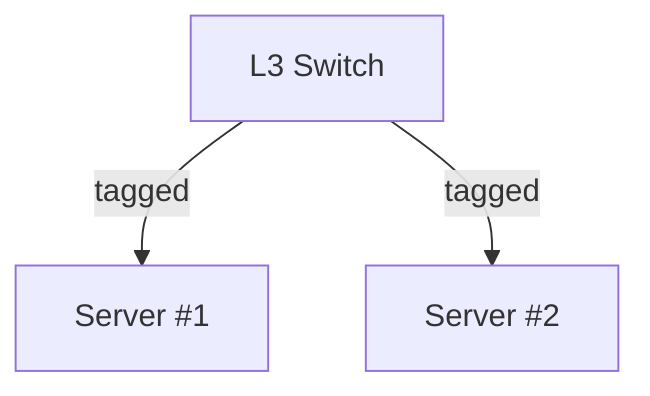

[TechnoTUT Network](/) 網内でサーバを運用しています。  
## 使用方法
使用方法については、以下のページを参照してください。  
- [仮想基盤](/service/virtualization)
- [コンテナ実行環境](/service/kubernetes)

## 構築
### 仮想基盤
[Proxmox VE](https://www.proxmox.com/proxmox-ve) を使用して、仮想基盤を構築します。DVDまたはUSBメモリからインストールします。  
インストール後、Webブラウザからアクセスし、設定を行います。  
https://192.168.99.99:8006/

#### ネットワーク
サーバは、L3スイッチにトランク接続されています。  
サーバ内の仮想マシン・コンテナは、任意のVLANに所属させることができます。

サーバをトランク接続する際は、以下の手順で`openvswitch`を設定します。  
```bash
apt update
apt install openvswitch-switch
```

Web UIの [対象ノード] > システム > ネットワーク を開きます。  
| 名前 | 種別 | ブリッジポート | VLAN ID |
| --- | --- | --- | --- |
| [NIC] | OVS Port | vmbr0 | - |
| vmbr0 | OVS Bridge | [NIC] [vlan99] | - |
| vlan99 | OVS IntPort | vmbr0 | 99 | 

#### リポジトリ
Web UIの [対象ノード] > アップデート > リポジトリ を開きます。  
`enterprise` と `pve-enterprise` を削除し、`no-subscription` を追加します。  

### コンテナ実行環境
[k3s](https://k3s.io/) を使用して、コンテナ実行環境を構築します。  
#### 仮想マシンの作成
任意のLinuxディストリビューションで仮想マシンを作成します。  
ネットワークは、`vlan99`に接続し、IPアドレスを`192.168.99.33`に設定します。
#### インストール
Podネットワークは、`10.244.0.0/16`に設定します。
ネットワークプラグインは`calico` を使用し、ルータとBGPで接続します。  
```bash
sudo su -
curl -sfL https://get.k3s.io | K3S_KUBECONFIG_MODE="644" INSTALL_K3S_EXEC="--flannel-backend=none --cluster-cidr=10.244.0.0/16 --disable-network-policy --disable=traefik" sh -
```
#### ネットワーク
Calicoをインストールします。
```bash
kubectl create -f https://raw.githubusercontent.com/projectcalico/calico/v3.26.4/manifests/tigera-operator.yaml
kubectl create -f https://raw.githubusercontent.com/technotut/k3s/main/setup/calico-manifest/custom-resources.yaml
```
Calicoctlのインストールし、設定を行います。
```bash
cd /usr/local/bin
curl -L https://github.com/projectcalico/calico/releases/download/v3.26.4/calicoctl-linux-amd64 -o calicoctl
sudo chmod +x ./calicoctl
ln -s /etc/rancher/k3s/k3s.yaml ~/.kube/config
wget https://raw.githubusercontent.com/technotut/k3s/main/setup/calico-manifest/bgppeer.yaml
wget https://raw.githubusercontent.com/technotut/k3s/main/setup/calico-manifest/bgpconfig.yaml
calicoctl apply -f bgppeer.yaml
calicoctl apply -f bgpconfig.yaml
```
ファイアウォールの設定を行います。
下記のコマンドで、必要なポートを開放するか、`systemctl disable --now firewalld`で無効化します。
```bash
firewall-cmd --add-port=179/tcp --permanent
firewall-cmd --add-port=6443/tcp --permanent
firewall-cmd --add-port=10250/tcp --permanent
firewall-cmd --zone=trusted --add-source=10.43.0.0/16 --permanent
firewall-cmd --zone=trusted --add-source=10.244.0.0/16 --permanent
firewall-cmd --zone=trusted --add-source=<client-cidr> --permanent
firewall-cmd --reload
```
ルータの設定を行います。
```terminal
router bgp 65000
  neighbor 192.168.99.33 remote-as 65000
  address-family ipv4 unicast
    network 192.168.10.0/24
    network 192.168.11.0/24
    network 192.168.20.0/24
    network 192.168.99.0/24
    exit
  exit
writ memory
```
BGPの設定が適切であるか、経路交換が行われているか確認します。
```bash
calicoctl get nodes -o wide
calicoctl get bgpPeer -o wide
calicoctl get ippool -o wide
calicoctl get bgpConfiguration -o wide
watch kubectl get pod -A -o wide
ip route
```
#### ボリューム
KubernetesにおけるPersistentVolumeの設定を行います。  
KubernetesはマニフェストのPersistentVolumeClainに応じて、自動で永続ボリュームを割当てます。  
```bash
mkdir /nfs
dnf install nfs-utils
systemctl enable --now nfs-server
echo "/nfs localhost(rw,no_root_squash)" >> /etc/exports
exportfs -a
exportfs
firewall-cmd --add-service=nfs --permanent
firewall-cmd --reload
```
Helmをインストールします。
```bash
cd /usr/local/bin
wget https://get.helm.sh/helm-v3.13.2-linux-amd64.tar.gz
tar -zxvf helm-v3.13.2-linux-amd64.tar.gz
mv linux-amd64/helm /usr/local/bin/helm 
rm linux-amd64
rm helm-v3.13.2-linux-amd64.tar.gz
```
Helmを使って、[nfs-subdir-external-provisioner](https://github.com/kubernetes-sigs/nfs-subdir-external-provisioner)をインストールします。
```bash
helm repo add nfs-subdir-external-provisioner https://kubernetes-sigs.github.io/nfs-subdir-external-provisioner/
helm install nfs-subdir-external-provisioner nfs-subdir-external-provisioner/nfs-subdir-external-provisioner --set nfs.server=localhost --set nfs.path=/nfs
```
#### Kompose
Docker ComposeのマニフェストをKubernetesのマニフェストに変換するツールです。  
```bash
cd /usr/local/bin
curl -L https://github.com/kubernetes/kompose/releases/download/v1.31.2/kompose-linux-amd64 -o kompose
chmod +x kompose
```
#### ArgoCD
ArgoCDは、KubernetesのCDツールです。  
```bash
kubectl create namespace argocd
kubectl apply -n argocd -f https://raw.githubusercontent.com/technotut/k3s/main/setup/argocd/install.yaml
cd /usr/local/bin
curl -L https://github.com/argoproj/argo-cd/releases/download/v2.9.2/argocd-linux-amd64 -o argocd
chmod +x argocd
firewall-cmd --add-port=30001/tcp --permanent
firewall-cmd --reload
```
ArgoCDのWeb UIは、`https://192.168.99.33:30001`から開くことができます。